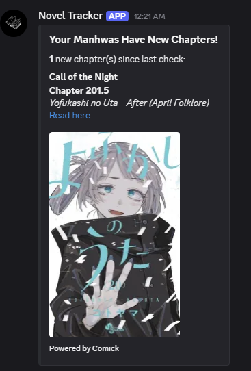

# Manhwa Bot

[](https://github.com/Coverst-ux/Manhwa-Bot/actions/workflows/tests.yml)

A Discord bot for searching, tracking, and receiving automatic chapter update notifications for manhwa and manga — built on the Comick API with a fully async Python backend.



## Features
- **Search Manhwa** - Find any manhwa using `/search`
- **Track Series** - Add manhwa to your personal tracking list with `/add_manhwa`
- **Automatic Notifications** - Get automatic DM alerts when new chapters release for tracked series
- **Manage List** - View tracked series with `/list_manhwas` or remove them with `/remove_manhwa`
- **Latest Chapter** - Check the latest chapter of any manhwa with `/latestchapter`
- **Manual Check** - Manually trigger an update check with `/manual_check`
- **Local Storage** - All data stored locally in SQLite (no cloud dependency)

## Tech Stack
- **Python 3.10+** — core language
- **discord.py** — bot framework with cog-based architecture
- **aiohttp** — async HTTP client with retry logic and timeout handling
- **aiosqlite** — async SQLite for persistent user tracking data
- **Comick API** — manga/manhwa metadata and chapter data source

## Architecture
The bot uses a multi-cog architecture separating concerns across files:
- `Hybrid_Commands` — search, details, and latest chapter commands
- `Tracking` — add/remove/list with a 24-hour background task loop for automatic notifications
- `Manual_Check` — on-demand update checking with slug resolution fallback
- `Owner_Commands` — admin utilities

## Prerequisites
- Python 3.10 or higher
- A Discord bot token (create one at [Discord Developer Portal](https://discord.com/developers/applications))
- A Discord server where you have permission to add bots

## Installation

1. **Clone the repository**
```bash
git clone https://github.com/Coverst-ux/Manhwa-Bot.git
cd Manhwa-Bot
```

2. **Install dependencies**
```bash
pip install -r requirements.txt
```

3. **Set up your bot token**
   - Create a `.env` file in the project root using `.env.example` as a template:
```
   TOKEN=your_bot_token_here
```

4. **Run the bot**
```bash
python main.py
```

## Usage

| Command | Description |
|---------|-------------|
| `/search {title}` | Search for a manhwa by title |
| `/getdetails {title}` | Get detailed info about a manhwa |
| `/latestchapter {title}` | Get the latest chapter of a manhwa |
| `/add_manhwa {title}` | Add a manhwa to your tracking list |
| `/remove_manhwa {title}` | Remove a manhwa from your tracking list |
| `/list_manhwa` | View all manhwa you are currently tracking |
| `/manual_check` | Manually check for new chapters across your list |

## Project Status

- ✅ Search with rich embeds and cover images
- ✅ Manual tracking (add/remove/list)
- ✅ Automatic chapter update notifications every 24 hours
- ✅ Manual update check with slug resolution fallback
- ✅ Structured logging across all modules
- ✅ Local SQLite storage with proper schema constraints

**Planned:**
- 🔄 pytest test suite
- 🔄 Web dashboard for tracking

## Permissions Required
The bot requires the following Discord permissions:
- Send Messages
- Embed Links
- Direct Messages

## Troubleshooting

**Bot not showing up in Discord?**
- Verify your bot token is correct in the `.env` file
- Ensure the bot has been invited to your server with the correct permissions

**Commands not working?**
- Slash commands may take up to 1 hour to appear globally after first launch
- Ensure the bot has "Send Messages" and "Embed Links" permissions

**Not receiving DM notifications?**
- Make sure your Discord privacy settings allow DMs from server members

## License
This project is open source and available under the MIT License.
